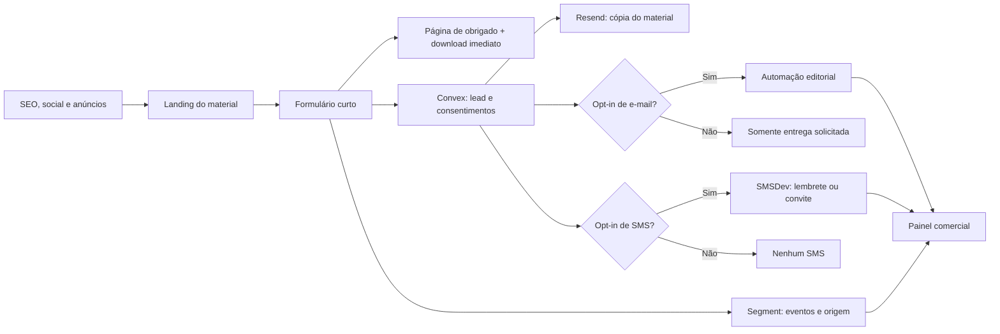

# Sistema de materiais ricos e aquisição da Flowo

**Status:** coleção publicada; catálogo e automação v2 validados localmente

**Data:** 9 de agosto de 2026

**Escopo:** PDFs, páginas de captura, Segment, Convex, Resend, SMSDev e operação comercial

## Decisão

A Flowo deve tratar PDFs como produtos editoriais úteis, não como brindes genéricos. Cada
material resolve uma decisão operacional real da barbearia e leva o leitor ao próximo passo
sem esconder a resposta atrás de uma venda.

O **Raio-X da Agenda** é o diagnóstico completo, com escala por barbeiro,
regras da recepção, testes e plano de sete dias. **Agenda sem Interrupção** é
uma folha de aplicação mais curta para quem chegou pelas calculadoras ou pela
biblioteca. Os dois ativos têm intenção e sequência próprias; não devem ser
apresentados como versões equivalentes.

## Portfólio proposto

| Ordem | Material | Formato | Intenção observável |
| --- | --- | --- | --- |
| 1 | Raio-X da Agenda | Workbook, 12 páginas | Organização de agenda e atendimento |
| 2 | Agenda sem Interrupção | Guia preenchível, 8 páginas | Aplicação rápida em WhatsApp e agenda |
| 3 | Fechamento da Equipe | Guia preenchível, 8 páginas | Conferência de regras e acerto |
| 4 | Comissões sem Planilha Paralela | Guia preenchível, 8 páginas | Conferência de comandas e comissão |
| 5 | Clientes na Hora de Voltar | Plano preenchível, 8 páginas | Retorno responsável de clientes |
| 6 | Retorno sem Spam | Guia preenchível, 8 páginas | Consentimento e cadência de retorno |
| 7 | Caixa sem Confusão | Guia preenchível, 8 páginas | Caixa e pagamentos opcionais |

O catálogo também oferece 14 planilhas, checklists e roteiros em XLSX/CSV. Os
20 itens têm identificador estável no formulário e, com o Raio-X, formam uma
allowlist de 21 recursos que podem ser entregues novamente por e-mail.

O conteúdo de pagamentos deve deixar explícito que receber pela plataforma é opcional. O
material de retorno apresenta o Flowo Recupera como adicional em beta, sem prometer
resultado automático e sem confundi-lo com o produto principal.

## Direção visual

- Base editorial em papel: creme quente, branco e tinta `#171810`.
- Poppins para instrução e interface; Lora para títulos editoriais curtos.
- Verde apenas para ação, progresso, confirmação e pontos de atenção positivos.
- Capas reconhecíveis como uma coleção, com uma faixa, índice e hierarquia consistentes.
- Checklists, tabelas e quadros preenchíveis; nenhum gráfico com dado simulado.
- Logo oficial da Flowo; nenhuma reconstrução ou adaptação improvisada da marca.
- PDF acessível e leve, com fontes incorporadas, texto selecionável e links descritivos.

Referências usadas: linguagem de papel tátil da Symbolic, precisão de ledger da Operate,
contraste editorial da Elementor e estrutura de páginas de ebook/playbook de Slack, Loom e
ManyChat. A composição final permanece própria da Flowo.

### Linguagem da barbearia

A copy foi revisada em 30 de julho de 2026 com páginas públicas do mercado brasileiro para
identificar situações e palavras reconhecíveis pelo público. As fontes não são prova de
resultado nem depoimentos de clientes da Flowo; servem apenas como pesquisa de linguagem:

- [WhatsAgenda para barbearias](https://whatsagenda.com/barbearias): mensagens de preço e
  horário, faltas, agenda bagunçada e cadeira vazia;
- [Navalhada](https://www.navalhada.com.br/): parar para responder “tem horário?”, agenda
  individual e horários realmente livres;
- [Barbeiro.app](https://www.barbeiro.app/): interromper o corte, cliente que não aparece,
  comissões e horários diferentes por barbeiro;
- [GENDA](https://genda.work/): buraco na agenda, horário morto, confirmação e cliente
  sumido.

Palavras preferidas: `corte`, `cadeira`, `agenda`, `horário`, `barbeiro`, `folga`, `turno`,
`encaixe`, `comanda`, `comissão`, `acerto`, `cliente sumido` e `agenda furada`. Termos
internos como `handoff`, `jornada`, `teste de aceite`, `atrito` e `operação conectada` só
podem aparecer quando forem explicados por uma situação concreta. A copy deve mostrar a
cena: o WhatsApp toca no meio do corte, alguém confere a escala e o cliente espera a
resposta.

### Registro das referências

| Uso | Referência | Identificador no Refero |
| --- | --- | --- |
| Direção principal | Symbolic.ai — papel editorial e camadas táteis | `b49ec76c-1410-44cb-9de1-b5ac58255949` |
| Sistema operacional | Operate — ledger, micro-rótulos e linhas precisas | `a0f473eb-0310-4df5-b5f6-5bc124ad5954` |
| Contraste | Elementor — blocos monocromáticos de alto contraste | `86351665-7483-48d1-9be4-5fe456093686` |
| Biblioteca de recursos | ManyChat — cards escaneáveis e um CTA por ativo | `36d68a03-aac4-4492-9371-4998a1ff477d` |
| Landing de ebook | Slack — mockup, formulário, conteúdo e relacionados | `7fe0a2fd-a6ad-477e-bce4-2052b1e160aa` |
| Landing de playbook | Loom — hero em duas colunas e repetição de CTA | `83bdf058-860c-4308-9284-00411112e3fb` |

## Funil

### Experiência da página

1. Promessa específica e imagem real da capa.
2. Três entregáveis concretos, sem estatística decorativa.
3. Prévia de duas páginas internas.
4. “Para quem é” e “o que não é”.
5. Formulário com nome e e-mail; telefone é opcional.
6. Download liberado na página seguinte, sem obrigar o usuário a abrir o e-mail.
7. Cópia do link enviada por e-mail para conveniência.
8. CTA secundário para conhecer a Flowo ou falar com vendas.

O conteúdo editorial público relacionado permanece indexável. A landing é indexável e o PDF é
um ativo de conversão; não se deve esconder todo o conhecimento útil atrás do formulário.

## Consentimento e LGPD

Três finalidades devem ser registradas separadamente:

1. **Entrega solicitada:** uso dos dados necessário para entregar o material pedido.
2. **Marketing por e-mail:** opt-in opcional e não pré-marcado.
3. **Marketing por SMS:** opt-in opcional, próprio e não pré-marcado.

Recusar marketing nunca bloqueia o download. Cada registro deve guardar versão do texto,
origem, data/hora e identificador do material. Cancelamento, bounce, resposta humana,
oportunidade ganha ou perdida interrompem as automações correspondentes.

## Taxonomia do Segment

Nomes sugeridos:

| Evento | Momento | Propriedades sem PII |
| --- | --- | --- |
| `Lead Magnet Viewed` | Landing carregada | `lead_magnet_id`, `topic`, `landing_path`, UTMs |
| `Lead Magnet CTA Clicked` | CTA principal acionado | campos acima + `cta_location` |
| `Lead Magnet Form Started` | Primeiro campo utilizado | campos acima |
| `Lead Magnet Form Submitted` | Formulário aceito | campos acima + flags de consentimento |
| `Lead Magnet Delivered` | Entrega registrada | `lead_magnet_id`, `delivery_channel` |
| `Lead Magnet Downloaded` | Clique no PDF estático | `lead_magnet_id`, `source_surface` |
| `Lead Magnet Nurture Started` | Automação iniciada | `lead_magnet_id`, `sequence_id` |
| `Lead Magnet Product CTA Clicked` | Interesse no produto | `lead_magnet_id`, `cta_target` |

E-mail e telefone não entram em propriedades de `track`. Após o envio, `identify` associa o
usuário ao lead conforme as políticas das destinations habilitadas. Segment organiza eventos e
distribuição; ele não substitui o CRM nem o remetente.

## Fonte de verdade e responsabilidades

| Sistema | Responsabilidade |
| --- | --- |
| Site/Vercel | Landing, página de obrigado e PDF estático em CDN |
| Segment | Coleta de eventos, atribuição e roteamento |
| Convex | Lead, consentimentos, estágio, score e histórico comercial |
| Resend | Entrega transacional e automação de e-mail |
| WhatsApp Flowo | Atendimento iniciado pelo lead e jornadas autorizadas de marketing |
| SMSDev | SMS de marketing somente com consentimento específico |
| Painel Flowo | Fila de vendas, origem, interesse e próxima ação |

O download usa arquivo estático em `public/downloads`. A página de obrigado registra o clique no
cliente e aponta diretamente para a CDN. Isso evita anexos pesados e não cria uma função de
borda por download.

## Automação de e-mail

O e-mail de entrega é transacional e separado da automação de marketing:

| Momento | Mensagem | Objetivo |
| --- | --- | --- |
| Imediato | Seu material da Flowo | Entregar o link e permitir responder |
| Imediato após opt-in | Seu material: por onde começar | Orientar o primeiro uso |
| D+1 | Conseguiu aplicar o material? | Levar o conteúdo para a rotina |
| D+3 | Descubra onde sua agenda ainda perde tempo | Conectar ao diagnóstico |
| D+7 | Prefere que o sistema cuide desse fluxo? | Convidar para conversa com vendas |

Somente a entrega transacional independe de opt-in. Os quatro e-mails da
automação exigem consentimento de marketing. A automação para quando houver
resposta, contato humano, reunião, oportunidade ganha/perdida, cancelamento ou bounce. O remetente
continua no subdomínio isolado de marketing; autenticação e OTP nunca compartilham esse fluxo.

## WhatsApp e SMS

O WhatsApp tem dois caminhos distintos. Quando a pessoa inicia a conversa, a
Flowo pode responder dentro da janela de atendimento sem inscrevê-la em uma
jornada promocional. Para mensagens de marketing iniciadas pela Flowo, o opt-in
de WhatsApp é específico, opcional e revogável com `SAIR`.

SMS não será atalho para um consentimento ausente. Quando autorizado, a primeira versão deve ter
no máximo um lembrete útil e um convite curto, respeitando:

- Brasil apenas;
- janela das 09:00 às 18:00 BRT, de segunda a sábado;
- identificação da Flowo;
- instrução `SAIR`;
- limite diário, lote pequeno e flags de desligamento;
- pausa imediata após resposta ou contato comercial.

## Painel comercial

Cada lead deve mostrar:

- material solicitado e tema de interesse;
- primeiro e último toque;
- origem, campanha e landing;
- consentimento de e-mail, WhatsApp e SMS;
- eventos de download e CTA de produto;
- estágio, responsável e próxima ação;
- motivo de pausa ou supressão.

O score é explicável, não “mágico”. Exemplos de sinais: download, visita repetida, clique em
produto, visita a preços e pedido de contato. Os pesos só serão ajustados após dados reais.

## Distribuição

- Página pilar indexável para cada tema, ligada ao material.
- Blocos contextuais nos guias existentes, sem pop-up agressivo.
- Conteúdo recortado em carrossel, Reels/TikTok, LinkedIn e e-mail.
- UTM padronizada por ativo, canal, campanha e criativo.
- Link para o mesmo material em comparativos quando houver relação real com a intenção.
- Remarketing baseado em eventos de intenção; nunca em listas sem consentimento.

## Métricas

Sem metas inventadas no lançamento. Os primeiros 30 dias estabelecem a linha de base:

- visitas qualificadas por origem;
- início e conclusão do formulário;
- download entregue e efetivamente acionado;
- opt-in de e-mail e SMS, separadamente;
- clique no produto e em preços;
- pedido de contato;
- lead qualificado, reunião e oportunidade;
- cancelamento, bounce, reclamação e `SAIR`.

Toda métrica deve ser segmentável por material, origem e dispositivo. Mobile precisa ser tratado
como experiência principal, não como adaptação posterior.

## Rollout

### Fase 1 — fundação

- Aprovar direção visual e títulos.
- Retirar PDFs incompatíveis das campanhas.
- Produzir o playbook principal com revisão de produto.
- Criar landing e página de obrigado responsivas.
- Instrumentar eventos e consentimentos.

### Fase 2 — nutrição

- Publicar e-mail de entrega.
- Ativar sequência apenas para opt-in.
- Mostrar os sinais no painel comercial.
- Fazer teste completo em desktop e mobile.

### Fase 3 — distribuição

- Publicar cortes sociais e CTAs contextuais.
- Rodar campanha pequena para criar baseline.
- Revisar entregabilidade, custo e qualidade dos leads.
- Produzir o segundo material com base no interesse observado.

## Critérios de aceite

- Nenhuma promessa, preço ou comportamento contradiz o produto atual.
- Não há teste grátis, depósito ou pay-to-book.
- Pagamentos são descritos como opcionais.
- Fontes estão incorporadas e o PDF renderiza em macOS, Chrome, iOS e Android.
- Texto é selecionável, contrastes são legíveis e links têm rótulos claros.
- Formulário e download funcionam com marketing recusado.
- Consentimentos e supressões chegam ao Convex.
- Eventos aparecem no Segment sem PII em `track`.
- E-mail chega com domínio autenticado e unsubscribe funcional quando aplicável.
- SMS só sai no ambiente de produção após opt-in e aprovação operacional.
- O painel comercial explica origem, interesse e próxima ação.

## Materiais de URL preservada

Três arquivos antigos foram substituídos por edições atuais, sem alterar os URLs
que já podem ter backlinks:

- `guia-completo-barbearia.pdf` agora entrega o Guia de Gestão da Barbearia;
- `referencia-rapida-barbearia.pdf` agora entrega o Painel Semanal da Barbearia;
- `templates-stories-barbearia.pdf` agora entrega Stories com Cara da sua Barbearia.

As novas edições não exibem preços, teste grátis, metas universais ou promessas
de resultado. Os três recursos entraram no catálogo e no gate de captura. O
Raio-X continua em uma landing separada e o auditor valida essa referência como
material independente.
